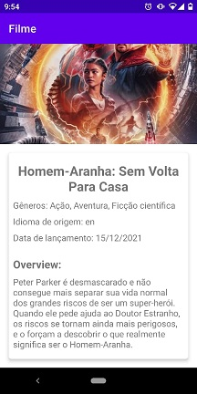
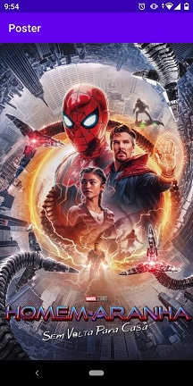

# Cine

Cine é um aplicativo para acompanhar filmes em cartaz. Neste app foi aplicada a arquitetura MVVM.

## Índice

* [Funcionalidades](#funcionalidades)
* [Aplicação](#aplicação)
* [Setup](#setup)
* [Ferramentas utilizadas](#ferramentas-utilizadas)
* [Autores](#autores)

## Funcionalidades

- 1ª Funcionalidade: Listar filmes em cartaz.
- 2ª Funcionalidade: Visualizar informações do filme selecionado.

## Aplicação

## Setup

- Clone o projeto:
    - $ git clone https://github.com/sebastiaolucas/Cine.git
- Abra o projeto:
    - Abra o 'Android Studio'
    - 'Open'
    - Procure pelo local onde clonou o projeto
    - 'Ok'
- Configuração:
    - 'File'
    - 'Settings...'
    - 'Build, Execution, Deployment'
    - Build tools > Gradle
    - Gragle JDK = Java version 11 ou superior

## Ferramentas utilizadas

- [Kotlin](https://kotlinlang.org/)
- [Android Studio](https://developer.android.com/studio)
- [Navigation](https://developer.android.com/guide/navigation)
- [Data Binding Library](https://developer.android.com/topic/libraries/data-binding?hl=pt-br)
- [Glide](https://bumptech.github.io/glide/)
- [ViewModel](https://developer.android.com/topic/libraries/architecture/viewmodel?hl=pt-br)
- [Koin](https://insert-koin.io/)
- [Room](https://developer.android.com/jetpack/androidx/releases/room)
- [Retrofit](https://square.github.io/retrofit/)
- [API The Movie Database](https://developers.themoviedb.org/3)

## Autores

| [ Sebastião Lucas](https://github.com/sebastiaolucas) | 
|:---: